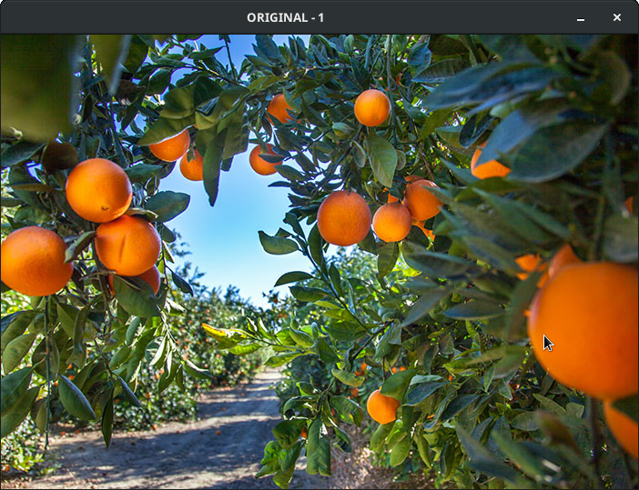
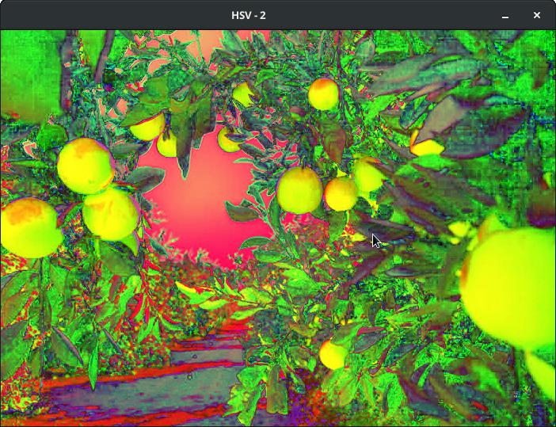
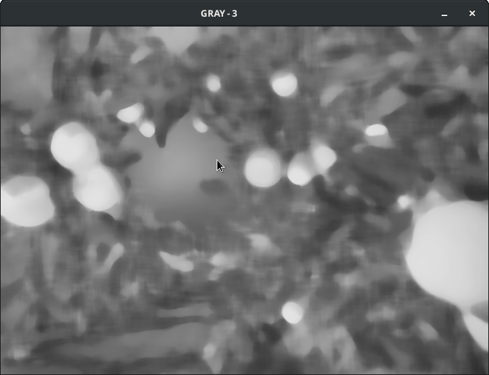
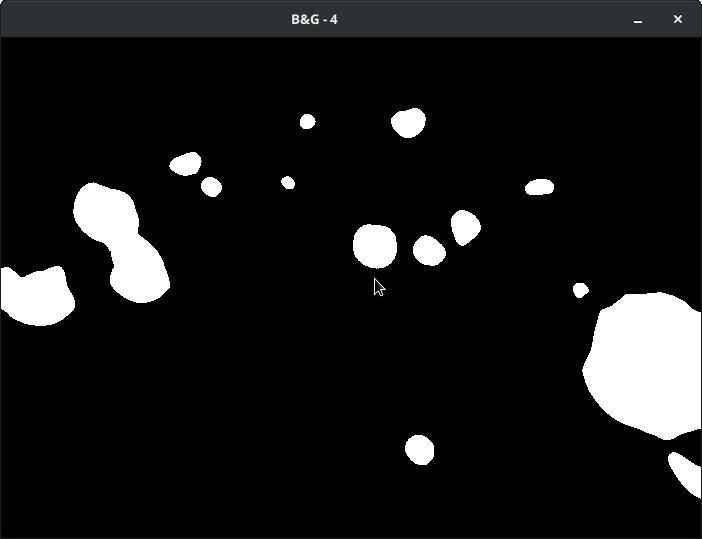
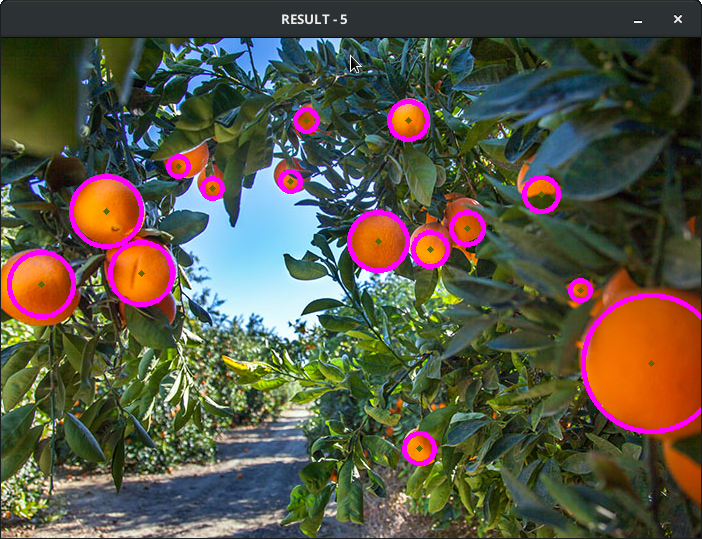

## Projeto utilizado na avaliação da discplina de processamento digital de imagens 2021/2
Utilização do openCV para reconhecimento de círculos (Hougcircles)

### Imagem original


### Pré-processamento da imagem

O tratamento da imagem foi feito em 3 passos

#### 1 - Conversão para o padrão HSV hue (Matiz), saturation (Saturação) e (Value)


``` java
Mat hsv = new Mat();
Imgproc.cvtColor(source, hsv, Imgproc.COLOR_BGR2HSV);
```

#### 2 - Median blur e Conversão para escala de cinza (Grayscale) 


``` java
Mat gray = new Mat();
Imgproc.cvtColor(hsv, gray, Imgproc.COLOR_BGR2GRAY);
Imgproc.medianBlur(gray, gray, 17);
```

#### 3 - Conversão para preto e branco utilizando o threshold


``` java
Mat bw = new Mat();
Imgproc.threshold(gray, bw, 190.0, 255.0, Imgproc.THRESH_BINARY);
```

##### Depois de todo pré-processamento, a imagem está pronta para ser utilizada no reconhecimento de círculos.
### Utilização algoritmo Hougcircles implementado no OpenCV
> Documentação oficial: https://docs.opencv.org/4.x/da/d53/tutorial_py_houghcircles.html.


``` java
Mat circles = new Mat();
Imgproc.HoughCircles(bw, circles, Imgproc.HOUGH_GRADIENT, 1, 40, 230.0, 13.3, 1, 75);
		
for (int x = 0; x < circles.cols(); x++) {
			
  double[] c = circles.get(0, x);
  Point center = new Point(Math.round(c[0]), Math.round(c[1]));
  
  Imgproc.circle(result, center, 1, new Scalar(0, 100, 100), 3, 8, 0);
  int radius = (int) Math.round(c[2]);
  Imgproc.circle(result, center, radius, new Scalar(255, 0, 255), 3, 8, 0);
}

```
---
#### Resultado final



